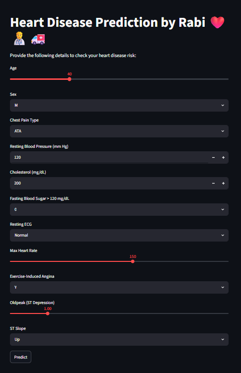

# ❤️ Heart Disease Prediction using Machine Learning

<p align="center">
  
  
  
  
</p>

A Machine Learning-based web application that predicts the risk of **heart disease** based on user-provided medical information.

The project uses a **K-Nearest Neighbors (KNN)** classification model and provides an interactive web interface built with **Streamlit**.

---

## 📌 Project Overview

Heart disease is one of the major health concerns worldwide. This project demonstrates how Machine Learning can be used to analyze health-related features and predict whether a person may be at risk of heart disease.

The complete workflow includes:

- Data preprocessing and cleaning
- Exploratory Data Analysis
Tell me w
- Categorical feature encoding
- Feature scaling
- Machine Learning model training
- Model evaluation
- Saving trained model components
- Building an interactive Streamlit web application

---

## 🖥️ Application Preview

<p align="center">
  
</p>

## 🚀 Features

- Interactive and user-friendly web interface
- Real-time prediction
- K-Nearest Neighbors (KNN) classification
- Pre-trained Machine Learning model
- Automatic feature scaling
- Handles categorical user inputs
- Instant risk prediction result

---

## 🧠 Machine Learning Model

The application uses the **K-Nearest Neighbors (KNN)** algorithm for classification.

The trained project components are stored as:

- `knn_heart_model.pkl` — Trained KNN model
- `heart_scaler.pkl` — Saved feature scaler
- `heart_columns.pkl` — Expected model input columns

These saved files allow the Streamlit application to make predictions without retraining the model every time.

---

## 📊 Model Performance

The model was evaluated on unseen test data using standard classification metrics.

| Metric | Score |
|---|---:|
| Accuracy | Add actual value |
| Precision | Add actual value |
| Recall | Add actual value |
| F1 Score | Add actual value |

> Note: Performance values are calculated on the test dataset.

## 📚 Dataset Information

The dataset contains clinical and health-related attributes used for binary heart disease classification.

- **Task:** Binary Classification
- **Target Variable:** `HeartDisease`
- **Number of Input Features:** 11
- **Number of Records:** Add actual value
- **Dataset Source:** Add actual source

### Target Classes

- `0` — Negative class
- `1` — Positive class

## 📊 Input Features

The application collects the following information:

| Feature | Description |
|---|---|
| Age | Age of the person |
| Sex | Male or Female |
| Chest Pain Type | Type of chest pain |
| Resting BP | Resting blood pressure |
| Cholesterol | Serum cholesterol level |
| Fasting BS | Fasting blood sugar |
| Resting ECG | Resting electrocardiogram result |
| Max HR | Maximum heart rate achieved |
| Exercise Angina | Exercise-induced angina |
| Oldpeak | ST depression value |
| ST Slope | Slope of peak exercise ST segment |

---

## 🛠️ Technologies Used

- Python
- Pandas
- NumPy
- Scikit-learn
- Streamlit
- Joblib
- Matplotlib
- Seaborn
- Jupyter Notebook

---

## 📂 Project Structure

```text
Heart-Disease-Prediction/
│
├── assets/
│   └── app_preview.png
│
├── HeartDisease.ipynb
├── app.py
├── heart_columns.pkl
├── heart_scaler.pkl
├── knn_heart_model.pkl
├── requirements.txt
├── .gitignore
└── README.md
```

### File Description

- `HeartDisease.ipynb` — Data preprocessing, analysis, model training and evaluation
- `app.py` — Streamlit web application
- `knn_heart_model.pkl` — Saved trained KNN model
- `heart_scaler.pkl` — Saved feature scaler
- `heart_columns.pkl` — Saved expected feature columns
- `requirements.txt` — Required Python dependencies
- `README.md` — Project documentation

---

## ⚙️ Installation and Setup

### 1. Clone the Repository

```bash
git clone https://github.com/Rabisankar1/Heart-Disease-Prediction.git
```

### 2. Move into the Project Folder

```bash
cd Heart-Disease-Prediction
```

### 3. Install Required Dependencies

```bash
python -m pip install -r requirements.txt
```

### 4. Run the Streamlit Application

```bash
python -m streamlit run app.py
```

The application will open in your web browser.

---

## 💻 How the Application Works

1. The user enters health-related information.
2. The input is converted into a Pandas DataFrame.
3. Missing encoded columns are automatically filled with zeros.
4. Input columns are reordered to match the training data.
5. The saved scaler transforms the input features.
6. The trained KNN model makes a prediction.
7. The application displays the predicted risk result.

---

## 📈 Prediction Output

The application provides one of two results:

- ⚠️ **High Risk of Heart Disease**
- ✅ **Low Risk of Heart Disease**

---

## 🔮 Future Improvements

- Compare KNN with Logistic Regression, SVM and Random Forest
- Add cross-validation and hyperparameter tuning
- Add prediction probability visualization
- Add confusion matrix and ROC curve
- Build a unified Scikit-learn preprocessing pipeline
- Improve model explainability
- Deploy the application online
- Add automated testing with GitHub Actions
---

## ⚠️ Disclaimer

This project is developed for **educational and learning purposes only**.

The predictions generated by this application should **not** be considered professional medical advice, diagnosis, or treatment. Always consult a qualified healthcare professional for medical concerns.

---

## 👨‍💻 Author

**Rabisankar Pradhan**

B.Tech in Computer Science and Engineering (Data Science)

Passionate about:

- Data Science
- Machine Learning
- Artificial Intelligence
- Software Development

---
